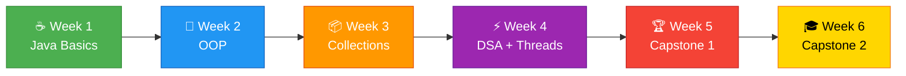

<div align="center">

<!-- ═══════════════════════════════════════════════════════════════ -->
<!--                        HEADER SECTION                         -->
<!-- ═══════════════════════════════════════════════════════════════ -->


<br/>


<br/>

[](https://github.com/mr-mk-dev/corportesGuide)
[](https://openjdk.org/)
[](https://www.mysql.com/)
[]()
[]()

<br/>

```
╔══════════════════════════════════════════════════════════════════╗
║                                                                  ║
║   🚀  6 Weeks  •  46 Hours  •  30 Days  •  2 Capstone Projects  ║
║   📝  5 Mock Evaluations  •  2 Mock Interviews  •  Certified    ║
║                                                                  ║
╚══════════════════════════════════════════════════════════════════╝
```

<br/>

> *"From `Hello World` to **Production-Ready Java Applications** — a complete transformation in 6 weeks."*

</div>

---

<!-- ═══════════════════════════════════════════════════════════════ -->
<!--                     TABLE OF CONTENTS                         -->
<!-- ═══════════════════════════════════════════════════════════════ -->

## 📑 Navigation

<div align="center">

[**🔎 About**](#-about) · [**🛠️ Tech Stack**](#️-tech-stack) · [**🗺️ Roadmap**](#️-curriculum-roadmap) · [**📁 Structure**](#-project-structure) · [**🏆 Capstones**](#-capstone-projects) · [**🚀 Setup**](#-getting-started) · [**📊 Progress**](#-weekly-progress) · [**👤 Author**](#-author)

</div>

---

<!-- ═══════════════════════════════════════════════════════════════ -->
<!--                       ABOUT SECTION                           -->
<!-- ═══════════════════════════════════════════════════════════════ -->

## 🔎 About

<table>
<tr>
<td width="50%">

### 📋 Program Details

| | |
|---|---|
| 🏢 **Organization** | Corporates Guide |
| 🎓 **Institute** | Heritage Institute of Technology |
| ⏳ **Duration** | 6 Weeks · 46 Hours |
| 📅 **Schedule** | 5 Days/Week · 1.5 Hrs/Day |
| 📝 **Evaluations** | Every Friday |
| 🎯 **Focus** | Java Backend + DSA |

</td>
<td width="50%">

### 🎯 Learning Outcomes

| | |
|---|---|
| ☕ | **Core Java** — Syntax, OOP, Collections |
| 🧠 | **DSA** — Search, Sort, Stack, Queue, BST |
| 🗄️ | **Database** — JDBC + MySQL |
| ⚡ | **Modern Java** — Streams, Lambdas, Threads |
| 🏗️ | **Projects** — 2 Full Capstone Apps |
| 🎤 | **Interviews** — 5 Evals + 2 Mock Interviews |

</td>
</tr>
</table>

---

<!-- ═══════════════════════════════════════════════════════════════ -->
<!--                      TECH STACK                               -->
<!-- ═══════════════════════════════════════════════════════════════ -->

## 🛠️ Tech Stack

<div align="center">

<table>
<tr>
<td align="center" width="110">

<br/><b>Java 17+</b>
<br/><sub>Core Language</sub>
</td>
<td align="center" width="110">

<br/><b>MySQL</b>
<br/><sub>Database</sub>
</td>
<td align="center" width="110">

<br/><b>IntelliJ</b>
<br/><sub>IDE</sub>
</td>
<td align="center" width="110">

<br/><b>Git</b>
<br/><sub>Version Control</sub>
</td>
<td align="center" width="110">

<br/><b>GitHub</b>
<br/><sub>Repository</sub>
</td>
</tr>
</table>

<br/>

```
  OOP  ·  Collections  ·  JDBC  ·  Streams API  ·  Multithreading  ·  Design Patterns
```

</div>

---

<!-- ═══════════════════════════════════════════════════════════════ -->
<!--                    CURRICULUM ROADMAP                         -->
<!-- ═══════════════════════════════════════════════════════════════ -->

## 🗺️ Curriculum Roadmap

<div align="center">



</div>

---

### 📘 Phase 1 — Java Fundamentals `Week 1–2`

<details>
<summary>🟢 <b>Week 1 — Environment, Syntax, Loops & Arrays</b></summary>
<br/>

| Day | 📚 Topics | 📝 Assignment |
|:---:|-----------|---------------|
| `01` | Java Overview · JDK/JRE/JVM · IDE Setup · Hello World | Install JDK + IDE, push to GitHub |
| `02` | Variables · Data Types · Type Casting · Operators · Strings | 10 Variable & String Exercises |
| `03` | Scanner I/O · if/else · switch-case (Classic + Java 14+) | Calculator + Grade System + ATM |
| `04` | for/while/do-while · break/continue · Nested Loops · Arrays | Patterns + Array Ops (Sum, Max, Rev) |
| `05` | 🔴 **MOCK EVAL** — Quiz: Java Basics (20 Questions) | Submit Week 1 Assignment |

</details>

<details>
<summary>🟢 <b>Week 2 — OOP: Classes, Inheritance, Polymorphism</b></summary>
<br/>

| Day | 📚 Topics | 📝 Assignment |
|:---:|-----------|---------------|
| `06` | OOP 4 Pillars · Classes & Objects · Constructors · `this` | Student class with constructors |
| `07` | Encapsulation · Access Modifiers · `static` · Overloading · `toString()` | BankAccount (encapsulated) |
| `08` | Inheritance · `super` · Method Overriding · `final` keyword | Animal → Dog, Cat hierarchy |
| `09` | Abstract Classes · Interfaces · Polymorphism · `instanceof` | Shape → Circle, Rectangle + Drawable |
| `10` | 🔴 **MOCK EVAL** — Written Test: OOP Concepts (25 Questions) | Banking System (OOP) |

</details>

---

### 📙 Phase 2 — Intermediate Java `Week 3–4`

<details>
<summary>🟡 <b>Week 3 — Collections, Exception Handling & File I/O</b></summary>
<br/>

| Day | 📚 Topics | 📝 Assignment |
|:---:|-----------|---------------|
| `11` | Collections Framework · ArrayList · LinkedList · Iterators | Student List + Queue Simulation |
| `12` | HashMap · HashSet · TreeMap · LinkedHashMap · Map.Entry | Phonebook + Word Frequency Counter |
| `13` | try/catch/finally · Checked vs Unchecked · Custom Exceptions | InsufficientFundsException |
| `14` | File I/O · BufferedReader/Writer · Serialization | File-based Student Record Saver |
| `15` | 🔴 **MOCK EVAL** — Technical: Collections + Exceptions | Submit Assignment 2 |

</details>

<details>
<summary>🟡 <b>Week 4 — Multithreading, DSA, Java 8+ & Design Patterns</b></summary>
<br/>

| Day | 📚 Topics | 📝 Assignment |
|:---:|-----------|---------------|
| `16` | Threads · Runnable · Synchronization · ExecutorService | Multi-threaded Task Executor |
| `17` | Big-O · Binary Search · Bubble/Selection Sort · Two-Pointer | Search + Sort + Pair Sum |
| `18` | Stack (LIFO) · Queue (FIFO) · Singly Linked List | Balanced Parentheses + Custom LL |
| `19` | BST · HashMap Patterns · Lambdas · Streams · Singleton/Factory | BST + Two Sum + Stream Filter |
| `20` | 🔴 **MOCK EVAL** — Full Technical Assessment (All Topics) | Submit Assignment 3 |

</details>

---

### 📕 Phase 3 — Capstone Projects `Week 5–6`

<details>
<summary>🔵 <b>Week 5 — 🏆 Capstone 1: Student Management System</b></summary>
<br/>

| Day | 📚 Topics | 🎯 Deliverable |
|:---:|-----------|----------------|
| `21` | System Design · UML · Auth Module · Package Structure | Design Doc + UML + Git Repo |
| `22` | SHA-256 Auth · Session Handling · Role-Based Access · JDBC | Working Auth Module |
| `23` | Full CRUD — Create, Read, Update, Delete, Search via JDBC | Complete CRUD Module |
| `24` | Validation · Custom Exceptions · CSV Export/Import | Integration Test Pass |
| `25` | 🔴 **MOCK INTERVIEW 1** — Technical Interview Simulation | Final Submission on GitHub |

</details>

<details>
<summary>🔵 <b>Week 6 — 🏆 Capstone 2: Library Management System</b></summary>
<br/>

| Day | 📚 Topics | 🎯 Deliverable |
|:---:|-----------|----------------|
| `26` | LMS Design · DB Schema · Auth · Feature Branch Planning | Design Doc + DB Schema |
| `27` | Book CRUD · Member CRUD · Borrow/Return via JDBC | Core Feature Modules |
| `28` | Fine Calculation · Reports · Stream API · Cache Layer | Business Logic Complete |
| `29` | Refactoring · Javadoc · Resume · GitHub & LinkedIn Polish | Updated Portfolio |
| `30` | 🔴 **MOCK INTERVIEW 2 + FINAL VIVA** | Final LMS + Demo 🎓 |

</details>

---

<!-- ═══════════════════════════════════════════════════════════════ -->
<!--                    PROJECT STRUCTURE                          -->
<!-- ═══════════════════════════════════════════════════════════════ -->

## 📁 Project Structure

```
corportesGuide/
│
├── 📂 src/
│   │
│   ├── 📁 Day1/                    # ☕ Java Basics — Hello World, Setup
│   ├── 📁 Day2/                    # 📊 Variables, Data Types, Operators
│   ├── 📁 Day3/                    # 🔀 Conditionals, Switch, Scanner
│   ├── 📁 Day4/                    # 🔁 Loops, Arrays, Patterns
│   ├── 📁 Day5/                    # 📝 Week 1 Mock Evaluation
│   ├── 📁 Day6-Day10/              # 🧩 OOP Concepts
│   ├── 📁 Day11-Day15/             # 📦 Collections, Exceptions, Files
│   ├── 📁 Day16-Day20/             # ⚡ Threads, DSA, Streams
│   │
│   ├── 📁 capstone1-sms/           # 🏆 Student Management System
│   │   ├── auth/                   #    └── Login, Register, SHA-256
│   │   ├── models/                 #    └── Student, User entities
│   │   ├── crud/                   #    └── JDBC CRUD operations
│   │   ├── exceptions/             #    └── Custom exceptions
│   │   └── utils/                  #    └── CSV, Validation helpers
│   │
│   └── 📁 capstone2-lms/           # 🏆 Library Management System
│       ├── auth/                   #    └── Librarian, Member auth
│       ├── books/                  #    └── Book CRUD
│       ├── members/                #    └── Member management
│       ├── borrow/                 #    └── Borrow/Return + Fines
│       └── reports/                #    └── Analytics & Reports
│
├── 📄 README.md
└── 📄 .gitignore
```

---

<!-- ═══════════════════════════════════════════════════════════════ -->
<!--                    CAPSTONE PROJECTS                          -->
<!-- ═══════════════════════════════════════════════════════════════ -->

## 🏆 Capstone Projects

<table>
<tr>
<td width="50%">

### 📌 Student Management System
*Week 5 · Console Application*

| Feature | Tech |
|---------|------|
| 🔐 Authentication | SHA-256 Hashing |
| 👤 Role-Based Access | Admin / Student |
| 📋 Full CRUD | JDBC + MySQL |
| 🔍 Smart Search | By ID or Name |
| ⚠️ Error Handling | Custom Exceptions |
| 📤 Data Export | CSV Import/Export |

</td>
<td width="50%">

### 📌 Library Management System
*Week 6 · Console Application*

| Feature | Tech |
|---------|------|
| 🔐 Authentication | Librarian / Member |
| 📚 Book Management | Full CRUD via JDBC |
| 🔄 Borrow/Return | Date Tracking |
| 💰 Fine Calculator | Auto Overdue Calc |
| 📊 Reports | Stream API Analytics |
| 🏗️ Design Patterns | Strategy + Cache |

</td>
</tr>
</table>

---

<!-- ═══════════════════════════════════════════════════════════════ -->
<!--                     GETTING STARTED                           -->
<!-- ═══════════════════════════════════════════════════════════════ -->

## 🚀 Getting Started

### Prerequisites

```
✅  Java JDK 17+        →  https://adoptium.net/
✅  MySQL 8.0+           →  https://dev.mysql.com/downloads/
✅  IntelliJ IDEA        →  https://www.jetbrains.com/idea/
✅  Git                  →  https://git-scm.com/
```

### Quick Start

```bash
# 📥 Clone the repository
git clone https://github.com/mr-mk-dev/corportesGuide.git

# 📂 Navigate to project
cd corportesGuide

# ☕ Open in IntelliJ IDEA → File → Open → Select project folder

# ▶️ Run any task → Navigate to src/DayX/ → Right-click → Run
```

---

<!-- ═══════════════════════════════════════════════════════════════ -->
<!--                     WEEKLY PROGRESS                           -->
<!-- ═══════════════════════════════════════════════════════════════ -->

## 📊 Weekly Progress

<div align="center">

| Week | Phase | Topics | Evaluation | Status |
|:----:|:-----:|--------|:----------:|:------:|
| **1** | 📘 Basics | Java Syntax, I/O, Loops, Arrays | Quiz (20 Qs) | 🔄 Current |
| **2** | 📘 OOP | Classes, Inheritance, Polymorphism | Written (25 Qs) | ⬜ Upcoming |
| **3** | 📙 Intermediate | Collections, Exceptions, File I/O | Technical Test | ⬜ Upcoming |
| **4** | 📙 Advanced | Threads, DSA, Streams, Patterns | Full Assessment | ⬜ Upcoming |
| **5** | 📕 Capstone | 🏆 Student Management System | Mock Interview 1 | ⬜ Upcoming |
| **6** | 📕 Capstone | 🏆 Library Management System | Interview + Viva | ⬜ Upcoming |

</div>

> 💡 *Update the status column as you progress: ✅ Done · 🔄 Current · ⬜ Upcoming*

---

<!-- ═══════════════════════════════════════════════════════════════ -->
<!--                        AUTHOR                                 -->
<!-- ═══════════════════════════════════════════════════════════════ -->

## 👤 Author

<div align="center">

### **Manish Kumar**

*Summer Intern @ Corporates Guide*
<br/>
*Heritage Institute of Technology*

<br/>

[](https://github.com/mr-mk-dev)
[](https://www.linkedin.com/in/manish825316/)
[](mailto:manish825316@gmail.com)

</div>

---

<!-- ═══════════════════════════════════════════════════════════════ -->
<!--                       FOOTER                                  -->
<!-- ═══════════════════════════════════════════════════════════════ -->

<div align="center">

### ⭐ If you found this helpful, give it a star!

<br/>


</div>
